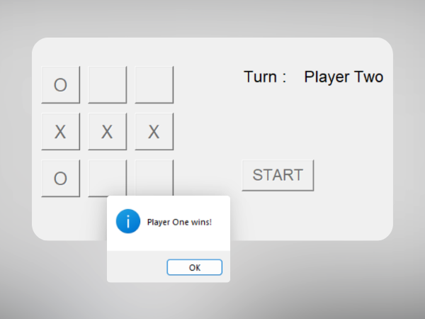

# Tic-Tac-Toe

Welcome to the Tic-Tac-Toe Desktop Application! This is a multiplayer game built using Python and TKinter for the graphical user interface. The game allows two players to play against each other on the same computer, keeping track of their points throughout the sessions.

## How to Play
1. **Run the Application:** To get started, run the Tic-Tac-Toe.py file. The game window will open, displaying the Tic-Tac-Toe board and options for the players.

2. **Game Rules:** The traditional Tic-Tac-Toe rules apply. Players take turns to place their symbols ('X' or 'O') on the board. The objective is to get three of your symbols in a row (horizontally, vertically, or diagonally) before your opponent does.

3. **Game Board:** The game board consists of a 3x3 grid. To place your symbol, simply click on the cell of your choice. The game will automatically switch turns between the players.

4. **Scoring:** The application keeps track of the points for both players throughout the sessions. The player who wins a round will earn a point, and in case of a draw, both players will receive zero points.

5. **Play Again:** After the game ends, you can choose to play another round. Click the "Play Again" button to start a new game.

## Screenshot

